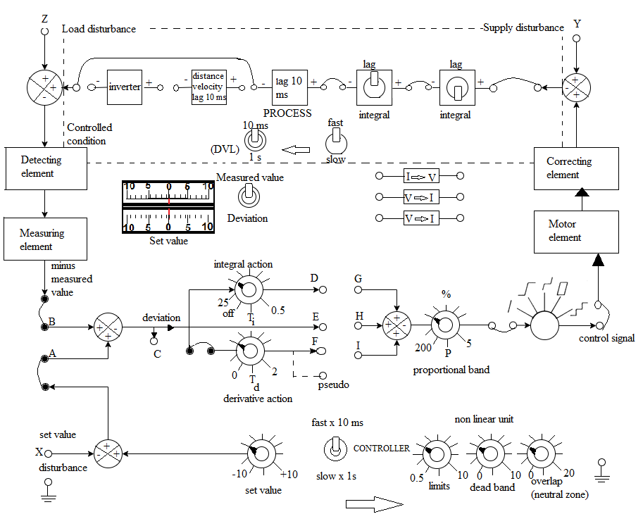

## Introduction

<b>Discipline | <b> Electrical Engineering 
:--|:--|
<b> Lab | <b> **Control and Instrumentation Lab**
<b> Experiment|     <b> **Study and operation of the Process Simulator setup**

### About the Experiment 
**System description**

The process control simulator utilizes integrated circuit operational amplifiers for specialized analog simulation. Its numerous variable interconnections, coupled with a selection of non-linear functions, enable in-depth exploration of both linear and non-linear process dynamics. Furthermore, it facilitates the implementation and analysis of proportional, integral, 
and derivative control modes. 

<b >Functional Description</b>

Fig. 1 shows the panel layout. 
A power on-off switch and an indicator lamp are mounted on the left hand side of the case. Range of all input and output signals is &plusmn; 10 V.  

<b>Fig. 1. Connection diagram for the Process Control Simulator</b>

<b>Subject matter expertise | <b> **Prof. Alok Kanti Deb**
:--|:--|
<b> Institute | <b>  **Indian Institute of Technology Kharagpur**
<b> Email id|     <b>  **alokkanti@ee.iitkgp.ac.in**
<b> Department |  **Department of Electrical Engineering**
<b>Webpage| <b> http://www.iitkgp.ac.in/department/EE/faculty/ee-alokkanti

### Contributors List

SrNo | Name | VLabs Developer or Integration Engineer | Designation | Department| Institute
:--|:--|:--|:--|:--|:--|
1 | **Piyali Chattopadhyay** | Developer | Project Scientist | Department of Electrical Engineering | IIT Kharagpur | 
2 | **Subhasis Mahata** | Integration Engineer | Senior Project Scientist | Department of Mechanical Engineering | IIT Kharagpur |