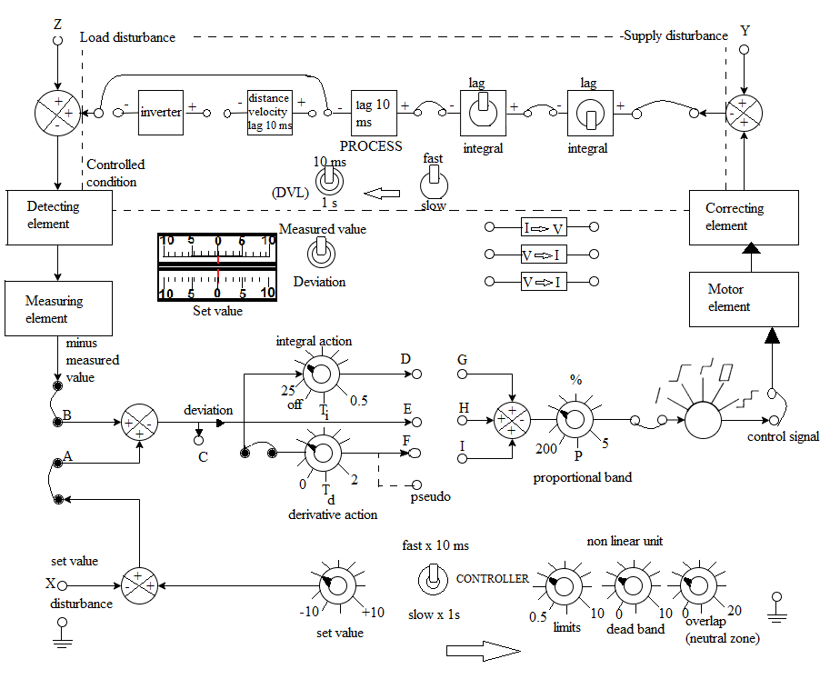

### Procedure

<b>Fig. 1. Connection diagram for the Process Control Simulator</b>

**Steps to perform the simulation**

<b>P Control</b>

1. First make the wire connection properly through the connecting dots (blue dots) in the process simulator kit, below the oscilloscope section following the below instructions.

2-7, 8-9, 10-11, 12-13, 21-22, 23-24, 37-38, 39-40, 28-29, 25-26, 23-42, 44-42, 46-43, 46-25 and 32-35 for proportional control. 45-22, 45-27 connections can be done for showing output signal or deviation signal respectively in oscilloscope channel-2 alternatively.

2. Click on 'Check Connection' button to check whether the connection is proper or not.
Click on the 'Power' button to switch on the oscilloscope.

3. Click on "Square" button (twice) to observe input signal. Apply amplitude to 5 Vp-p, frequency 0.2 Hz.

4. Apply 50 percent proportional band by rotating the 'proportional band' knob. 

5. Now click on 'Output' button to observe the output signal and enlarged signal plot for the particular proportional band. Channel-1 will show the input, Channel-2 will show the output and 'Dual' shows both the input and output signals. In the plot (at the bottom of the page) zoom in the overshoot part of the curve by selecting that part. Enter the peak value and steady state value in respective input boxes. Click on
'Calculate' button. Observe the steady state error and percentage overshoot. Click on 'Clear' button.

6. Delete connection 45-22 by clicking on the connected wire and connect 45-27, click on 'Check Connection' button to check whether the connection is proper or not. Now follow steps 3-5 to observe the deviation signal. 

7. Click on 'Clear' button each time after one observation. Check output and deviation for 30,200,5 percent proportional band following steps 1-6.

<b>PI Control</b>

1. First make the wire connection properly through the connecting dots (blue dots) in the process simulator kit, below the oscilloscope section following the below instructions.

2-7, 8-9, 10-11, 12-13, 21-22, 23-24, 37-38, 39-40, 28-29, 25-26, 23-42, 44-42, 46-43, 46-25 and 32-35, 30-31 for proportional integral control. 45-22, 45-27 connections can be done for showing output signal or deviation signal respectively in oscilloscope channel-2 alternatively.

2. Click on 'Check Connection' button to check whether the connection is proper or not. Click on the 'Power' button to switch on the oscilloscope.

3. Click on "Square" button (twice) to observe input signal. Apply amplitude to 5 Vp-p, frequency 0.2 Hz. 

4. Apply 100 percent proportional band by rotating the 'proportional band' knob (this will be fixed) and apply integral time 2 by rotating the 'integral action' knob. 

5. Now click on 'Output' button to observe the output signal and the enlarged signal plot for the particular integral time. Channel-1 will show the input, Channel-2 will show the output and 'Dual' shows both the input and output signals. In the plot (at the bottom of the page) zoom in the overshoot part of the curve by selecting that part. Enter the peak value and steady state value (if overshoots are there) in respective input boxes. Click on 'Calculate' button. Observe the steady state error and percentage overshoot. Click on 'Clear' button.					 

6. Delete connection 45-22 by clicking on the connected wire and connect 45-27, click on 'Check Connection' button to check whether the connection is proper or not. Now follow steps 3-5 to observe the deviation signal. 

7. Click on 'Clear' button each time after one observation. Check output and deviation by setting integral time to 5,10,25 following steps 1-6.

<b>PID Control</b>

1. First make the wire connection properly through the connecting dots (blue dots) in the process simulator kit below the oscilloscope section following the below instructions.

2-7, 8-9, 10-11, 12-13, 21-22, 23-24, 37-38, 39-40, 28-29, 25-26, 23-42, 44-42, 46-43, 46-25 and 32-35, 30-31, 33-36 for proportional integral derivative control. 45-22, 45-27 connections can be done for showing output signal or deviation signal respectively in oscilloscope channel-2 alternatively.

2. Click on 'Check Connection' button to check whether the connection is proper or not. Click on the 'Power' button to switch on the oscilloscope.

3. Click on "Square" button (twice) to observe input signal. Apply amplitude to 5 Vp-p, frequency 0.2 Hz. 

4. Apply 50 percent proportional band by rotating the 'proportional band' knob (this will be fixed) and apply integral time 2 by rotating the 'integral action' knob (this will be fixed) , apply derivative time to 2 by rotating the 'derivative action' knob. 

5. Now click on 'Output' button to observe the output signal and the enlarged signal plot for the particular derivative time. Channel-1 will show the input, Channel-2 will show the output and 'Dual' shows both the input and output signals. In the plot (at the bottom of the page) zoom in the overshoot part of the curve by selecting that part. Enter the peak value and steady state value (if overshoots are there) in respective input boxes. Click on 'Calculate' button. Observe the steady state error and percentage overshoot. Click on 'Clear' button.				 

6. Delete connection 45-22 by clicking on the connected wire and connect 45-27, click on 'Check Connection' button to check whether the connection is proper or not. Now follow
steps 3-5 to observe the deviation signal. 

7. Click on 'Clear' button each time after one observation. Check output and deviation by setting derivative time to 1 following steps 1-6.
