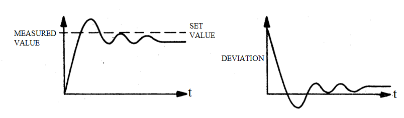

# Theory

The process control simulator is a special purpose analogue simulator employing integrated circuit operational amplifiers.  

 
<b>Fig. 1. Connection diagram for the Process Control Simulator</b>

 

<b >The Simulated Process</b> 

The process consists of following elements, each of which can be included or excluded from the entire process using jumper leads.  

i) 1 Simple lag of time constant 10 milliseconds or 1s. 
ii) 2 Lags of time constant 10 millseconds or 1 sec (each convertible by toggle switches to integrators of time constant 10 ms or 1 sec). 
iii) 1 Distance-velocity lag of delay 10 milliseconds or 1 second, selected by a toggle switch.  
iv) 1 Inverter  

The time constants of all the above elements can be set by one toggle switch to slow (1 s) or fast (10 ms) mode.  

<b >The Simulated Controller</b> 

The controller is of the PID type which generates a control signal  

$$u = k_p \ [ e(t)+ \frac{1}{T_i}\int_{0}^{t}e(\tau)d\tau + T_d \ \dot{e}(t) ]$$

The controller comprises the following elements :  
1 Set-value control of range &plusmn; 10 volts 
1 Comparing element  
1 Integral action control scaled in integral action time <i style="font-family:'Bodoni MT'">Ti</i> 
1 Derivative action control scaled in derivative action time <i style="font-family:'Bodoni MT'">Td</i> 
1 Proportional band control scaled in &percnt; proportional band PB = 100/<i style="font-family:'Bodoni MT';font-size:20px">kp</i>  

The comparing element generates the deviation as the difference between the controlled condition and
the set value, then passes it to the three–term controller comprising the integral, derivative, and proportional controls.
  
<b>Meter Indicator :</b> Two center-zero meters indicate the set value (lower meter) and either of the measured value or the deviation (upper meter) according to
the switch position selected. The sense of the meters is arranged to ensure correct polarities according to the equation 

<b>Deviation = Measured value - Set value</b>  

<b >Proportional Control System Response</b> 

Refer to Fig. 1 the points E to H is connected through a jumper wire to apply proportional control. At point A a square wave signal of amplitude 5 V p-p and frequency about 0.2 Hz is injected into the system. 
<!-- Alternatively the set value disturbance from point X and the negative measured value from the point B are displayed on an oscilloscope ,
with both process and controller switches at fast. -->

The measured value and deviation can be observed from points B and C respectively. It is observed that the system moves slowly towards the set value. As the percentage proportional band is reduced, i.e,
the gain of the system is increased, the steady state deviation is reduced and the system settles with its measured value much closer to the set value.
In order to reduce the steady state deviation to zero, however, the gain must be increased to such a value that the system becomes completely unstable.
<!--A compromise gain level must be used which maintains a steady state deviation signal.--> 

The system response is shown in Fig. 2.  

 
<b> Fig. 2. Proportional Control System Response</b>

  

<b >Proportional plus Integral Control (PI) :</b>  

The points D to G is connected through a jumper wire for integral action. A square wave of 5 V p-p and 0.2 Hz is applied to the set value disturbance socket X . 
The proportional band control is adjusted to 50. Deviation socket C is monitored.
The difference between measured and set value is noted. The responses of system is noted for different settings of integral action control.

By suitable adjustment of the integrator time constant, the steady state deviation can be reduced to zero. In consequence, the measured value becomes much closer to set value.
Too much integral term however causes the system to go into oscillation. Generally an increase in the integral term reduces steady state deviation but increases the time, the system takes to settle. 

  <b >Proportional plus Integral plus Derivative Control (PID) :</b>  

Integral control improves the performance of the control system in some respects, i.e., reduces steady state deviation but has the disadvantage of slowing down the overall response time.
If a system is required to follow a sudden change in set value, this would give rise to a rapid change in the deviation. Although this deviation change is rapid,
the system responds rather slowly. If at this time controller output can be boosted, the speed of system response can be improved. If the deviation is differentiated 
i.e. its rate of change is measured and a signal is produced proportional to this, then added to the signals from the proportional and integrator sections, some improvement should result.
The points F to I is connected for derivative action.

All switches and controls as in Fig. 1 are set, the points for all the control actions (Proportional (E-H), Integral (D-G), Derivative (F-I)) are connected. A square wave input of 5 V p-p and 0.2 Hz is applied to the set value disturbance socket .
The derivative action control is slowly increased and the effect of this upon the system response is noted. 
Application of the derivative term does not have any effect upon the steady state deviation but reduces the settling time by reducing the number of oscillations.

						
								